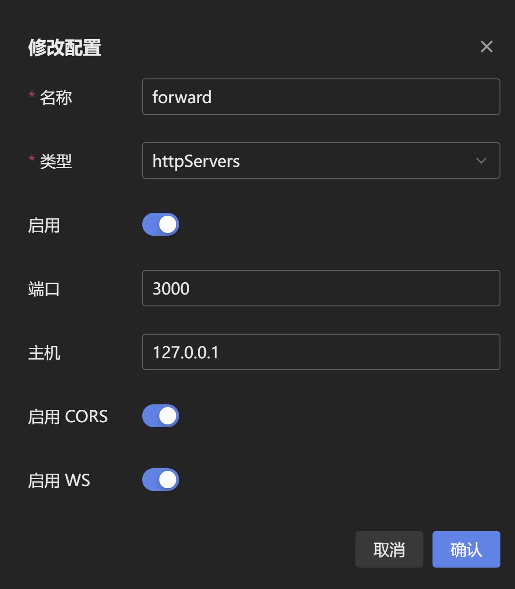

# JM PDF Plugin

适用于**LangBot+NapCat**的漫画下载插件🧩，支持缓存，指定章节下载，文案匹配，定时撤回✨

图像转PDF参考项目：[image2pdf](https://github.com/salikx/image2pdf) by [salikx](https://github.com/salikx)

## 插件功能🎨

- [x] 下载漫画并转换为PDF
- [x] 多章节漫画指定章节转换
- [x] 匹配文案对应jmID
- [x] 定时撤回，更适合Bot体质

## 使用方法❗

### 插件安装🛠️

配置完成 [QChatGPT](https://github.com/RockChinQ/QChatGPT) 主程序后使用管理员账号向机器人发送命令即可安装：

```
!plugin get https://github.com/AmethystTim/JM_PDF_plugin.git
```
或查看详细的[插件安装说明](https://github.com/RockChinQ/QChatGPT/wiki/5-%E6%8F%92%E4%BB%B6%E4%BD%BF%E7%94%A8)

### 网络配置🛜

在`NapCat`消息平台中新增**HTTP服务器**，主机为`127.0.0.1`，端口为`3000`

<div align="center">



</div>

### 偏好配置🔧

修改`config.yml`中的`base_dir`为你想存储漫画的目录

```yaml
# Github Actions 下载脚本配置
version: '2.0'

dir_rule:
  # 漫画/PDF的存储目录
  base_dir: "C:\\Users\\Hello\\Desktop\\downloads" 
  rule: Bd_Aid_Pindex

download:
  cache: true
  image:
    decode: true
    suffix: .jpg
  threading:
    # batch_count: 章节的批量下载图片线程数
    batch_count: 45
```

### 指令🤖

|指令|说明|参数|备注|
|-|-|-|-|
|`/jm`||||
|`/jm [jmID]`|根据禁漫号下载漫画|`jmID`|`jmID`：漫画ID|
|`/jm [jmID] [chapter]`|下载指定章节漫画|`jmID` `chapter`|`chapter`：指定章节|

### 演示✨

#### 单章节漫画

<div align="center">


</div>

#### 多章节漫画

<div align="center">


</div>

<div align="center">


</div>

#### 文案匹配

<div align="center">


</div>

### 计划实现🔮

先挖坑，之后随缘填，有任何想法欢迎提issue或PR

- [x] 定时撤回
- [ ] 定时清理缓存漫画

### 常见问题❓

|Q|A|
|-|-|
|插件加载失败|请按照README中的安装步骤进行，并确保您的插件**目录名称**为`JM_PDF_plugin`|
|本子下载到本地后无法发出|待下载漫画可能为长篇漫画，下载全部章节所需时间过长，推荐下载短篇<br>|
|与`langbot`内置AI对话冲突|issue [#4](https://github.com/AmethystTim/JM_PDF_plugin/issues/4)|
|`Docker`部署langbot导致的路径问题|issue [#9](https://github.com/AmethystTim/JM_PDF_plugin/issues/9)|


> 有其他问题欢迎提issue或在交流群讨论