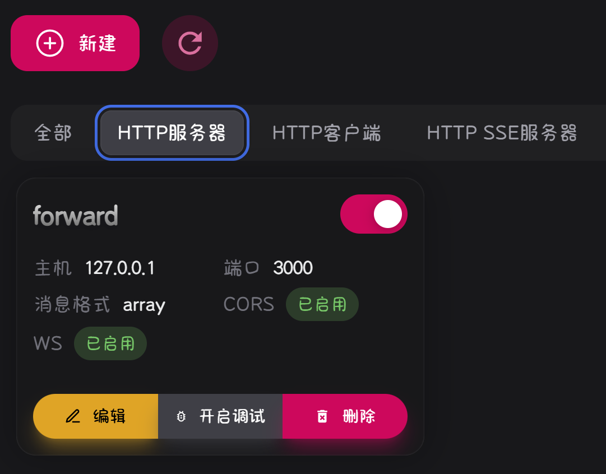
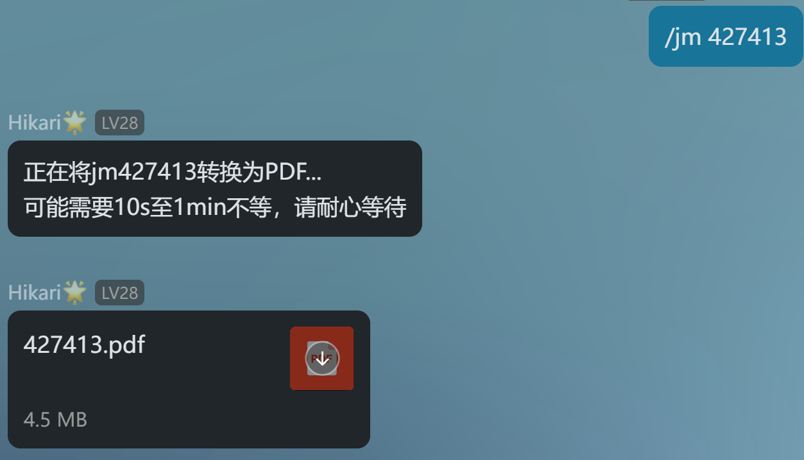
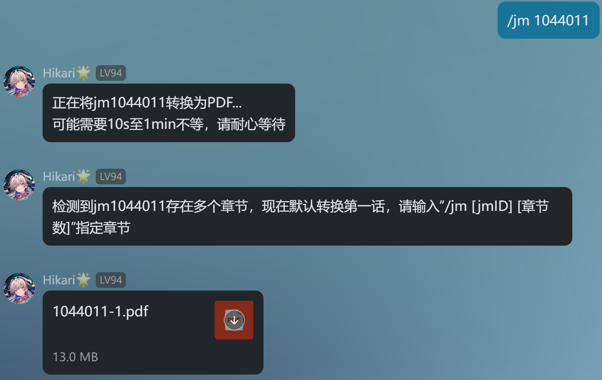
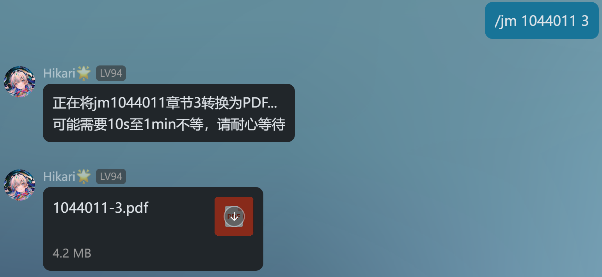
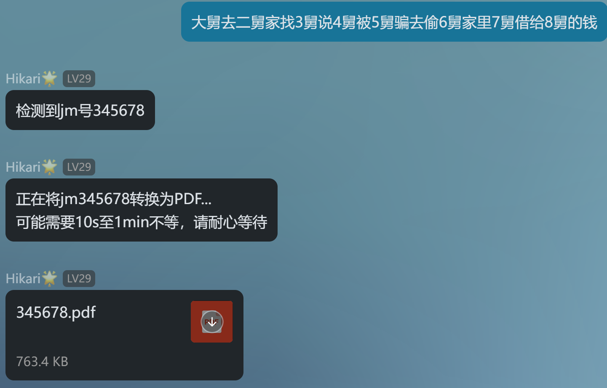
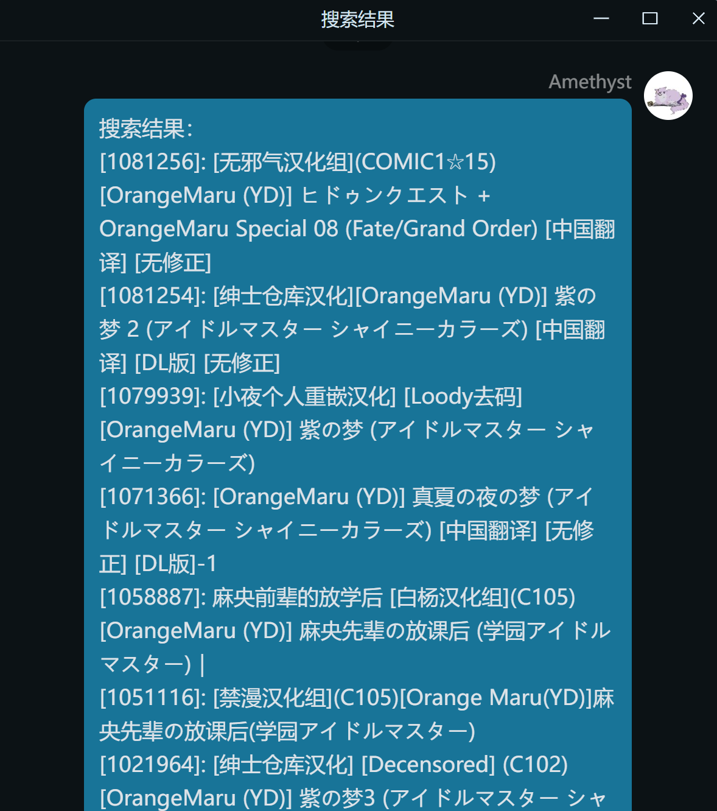

# JM PDF Plugin

## 这是什么？🤔

一个适用于**LangBot+NapCat消息平台**的漫画下载插件🧩

将你想看的漫画转换为PDF，上传到QQ群聊/QQ私信中

目前**支持缓存**，**指定章节下载**，**文案匹配**，**定时撤回**，**关键词搜索**，**白名单管理**✨

<hr>

## 插件功能🎨

- ✅：已实现
- 🚧：开发中

|功能描述|实现情况|
|-|-|
|漫画转PDF|✅|
|指定章节转换|✅|
|匹配文案对应jmID|✅|
|定时撤回|✅|
|缓存漫画|✅|
|关键词搜索|✅|
|白名单管理|✅|
|指令管理|✅|
|定时撤回|✅|
|获取分类/排行榜|🚧|

<hr>

---

## 插件架构⚙️

```
JM_PDF_plugin/
│
├── cells/                # 独立模块
│   ├── apicaller.py      # 消息平台API调用模块
│   ├── argsparser.py     # 参数解析模块
│   ├── controller.py     # 控制器模块
│   ├── converter.py      # 转换器模块
│   └── downloader.py     # 下载器模块
│
├── utils/                # 实用工具模块
│   ├── cacheclener.py    # 缓存清理模块
│   ├── filehandler.py    # 文件处理模块
│   └── searchhandler.py  # 站内搜索模块
│
├── handlers/             # 指令处理模块
│   ├── jmmanga.py        # 处理漫画下载
│   ├── jmsearch.py       # 处理漫画搜索
│   └── jmclear.py        # 处理缓存清理
│
├── config.yml            # JM下载配置文件
├── commands.yml          # 指令管理配置文件
│
├── main.py               # 插件主程序入口
├── requirements.txt      # 依赖列表
│
└── README.md             # 项目说明文档
```

## 使用方法🧭

### 1. 插件安装🛠️

#### 方法一：管理员账号安装

配置完成 [LangBot](https://github.com/RockChinQ/LangBot) 主程序后使用管理员账号向机器人发送命令即可安装：

```
!plugin get https://github.com/AmethystTim/JM_PDF_plugin.git
```
或查看详细的[安装说明](https://docs.langbot.app/insight/guide)

#### 方法二：git安装（推荐）

进入`Langbot`的`plugins`目录，使用`git`克隆`JM_PDF_plugin`仓库：

```
git clone https://github.com/AmethystTim/JM_PDF_plugin.git
```

#### 方法三：插件市场安装（不推荐）

访问`Langbot webui`（默认为`127.0.0.1:5300`），进入**插件市场**，搜索`JM-PDF-plugin`进行安装

---

**注意**❗

由于项目名称发生过更改，使用插件市场直接安装插件可能会导致某些不可预测的问题

---

### 2. 网络配置🔗

- 访问`NapCat`消息平台的webui（默认为`http://127.0.0.1:6099`）
- 在**网络配置**栏目中新建**HTTP服务器**
- 主机填写为`127.0.0.1`，端口填写为`3000`

<div align="center">



</div>

---

**注意**❗

若发生端口冲突，请将网络配置的端口修改为其他值

同时将`main.py`文件

```
self.msg_platform = MsgPlatform('127.0.0.1', 3000)
```

一行的端口`3000`修改为新端口值

---

### 3. 偏好配置🔧

#### 3.1 下载配置 config.yml

- `dir_rule`部分：修改`base_dir`为你想存储漫画的目录
- `client`部分：若均无法访问可尝试用“**#**”注释掉`client`所有部分，使用默认配置的域名列表
- `download`部分：一般情况下可忽略
- `plugins`部分：大部分漫画都可以在**无登录状态下**访问/下载，但是有些漫画需要登录才可以查看，若有需要可以配置你的账号信息

```yaml
# Github Actions 下载脚本配置
version: '2.0'

dir_rule:
  base_dir: "C:\\Users\\Hello\\Desktop\\downloads" # 漫画/PDF的存储目录（注意转义字符的使用）
  rule: Bd_Aid_Pindex

# 域名配置，若均无法访问可尝试用“#”注释client所有部分，以使用默认配置的域名列表
client:
  impl: api
  domain:
    api:
      - www.cdnmhws.cc
      - www.cdnuc.vip
      - www.cdnmhwscc.vip
      - www.cdnblackmyth.club

# 下载配置，无需关注
download:
  cache: true # 如果要下载的文件在磁盘上已存在，不用再下一遍了吧？
  image:
    decode: true # JM的原图是混淆过的，要不要还原？
    suffix: .jpg # 把图片都转为.jpg格式
  threading:
    # batch_count: 章节的批量下载图片线程数
    batch_count: 45

# jmcomic包插件项配置，非必需配置
plugins:
  after_init:
    - plugin: login # 登录插件，以下载某些需要登录才能下载的漫画，需要配置登录信息
      kwargs:
        username: your_username # 用户名
        password: your_password # 密码
```
---

**MacOS用户注意**❗

由于MacOS版NapCat权限原因，需要将`base_dir`一项修改为`NapCat`的缓存目录：

```
/Users/<your_username>/Library/Containers/com.tencent.qq/Data/.config/QQ/NapCat/temp
```

---

#### 3.2 指令管理 commands.yml

- `whitelist`部分：若要启用群聊白名单，请将`enabled`设置为`true`，并填入需要加入白名单的群聊id
- `commands`部分：为了防止意外触发某些指令炸群，请根据你的实际需求禁用/激活指令，若要禁用某指令，请将对应值由`true`修改为`false`
- 以上配置需要**重载插件**/**重启bot**后才会生效

```yaml
# 插件指令管理

# 白名单机制，启用后仅允许白名单群聊/用户使用指令
whitelist: 
  # 是否启用白名单
  enabled: false
  # 白名单群聊/用户id
  groups: [
    114514,
  ]
  users: [
    1919810,
  ]

# 指令管理列表，若需禁用某指令，则将其对应值由true修改为false
commands: [
  # 指令：/jm [jmID] [chapter]
  "/jm [ID] [CHAPTER]": true,
  # 指令：/jm search [keyword]
  "/jm search [KEYWORD]": true,
  # 指令： 清除缓存
  "/jm clear": true,
  # 指令：文案匹配
  "[text]": false,
]
```

## 常见问题❓

|Q|A|
|-|-|
|插件加载失败|请不要直接从`Langbot webui`的插件市场中直接安装，请按照README中的安装步骤进行，并确保您的插件**目录名称**为`JM_PDF_plugin`|
|漫画下载失败|1. 检查网络配置，推荐添加网络代理<br>2. 检查`jmcomic`包是否为最新版本，建议`pip install -U jmcomic`后重启bot（issue [#23](https://github.com/AmethystTim/JM_PDF_plugin/issues/23)）<br>3. 在`config.yml`内`client`的`domain`一项中添加可用域名或将`client`全部注释掉以使用默认域名列表|
|与`langbot`内置AI对话冲突|issue [#4](https://github.com/AmethystTim/JM_PDF_plugin/issues/4)|
|`Docker`部署Langbot导致的路径问题|issue [#9](https://github.com/AmethystTim/JM_PDF_plugin/issues/9)|
|`Docker`部署Langbot无法连接消息平台|issue [#32](https://github.com/AmethystTim/JM_PDF_plugin/issues/32)|
|控制台报错：无效的`apikey`|与插件无关，可能是LangBot的`provider.json`配置有误|

> 有其他问题欢迎提issue或在交流群讨论

## 指令🤖

|指令|说明|参数|备注|
|-|-|-|-|
|`/jm (help)`|查看帮助信息|-|可选参数：`help`|
|`/jm [jmID] [chapter]`|下载漫画指定章节|`jmID` `chapter`|`chapter`：指定章节，若不指定默认转换第一章|
|`/jm search [keyword]`|搜索漫画|`keyword`|`keyword`：搜索关键字|
|`/jm clear`|清除缓存|-|-|

## 演示✨

### 单章节漫画

<details>

<summary>展开查看</summary>

<div align="center">



</div>

</details>

### 多章节漫画

<details>

<summary>展开查看</summary>

<div align="center">



</div>

<div align="center">



</div>

</details>

### 文案匹配

<details>

<summary>展开查看</summary>

<div align="center">



</div>

</details>

### 搜索漫画

<details>

<summary>展开查看</summary>

<div align="center">




</div>

</details>

## 致谢🤝

- **用于爬取JM的Python API封装**：[JMComic-Crawler-Python](https://github.com/hect0x7/JMComic-Crawler-Python) by [hect0x7](https://github.com/hect0x7)
- **图像转PDF**：[image2pdf](https://github.com/salikx/image2pdf) by [salikx](https://github.com/salikx)
